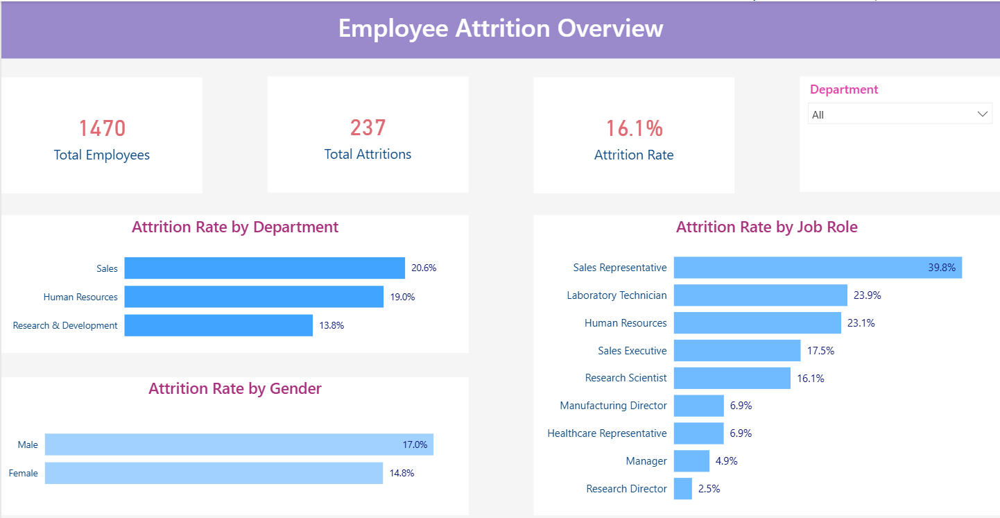
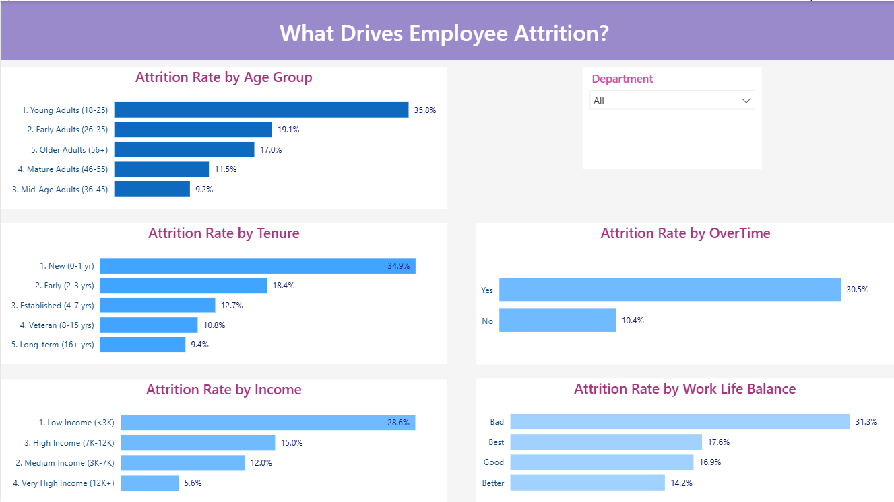

# IBM HR Employee Attrition Analysis

This project analyzes employee attrition patterns using the IBM HR Analytics dataset. Built in Power BI, the dashboard explores who is leaving, which departments are most affected, and what factors — such as overtime, income, and tenure — drive attrition.

**Tools:** Power BI · DAX · Power Query

---




---

## Key Findings

- **Sales Representatives** have the highest attrition rate at 39.8% — nearly 4 in 10 leave
- **Overtime is the strongest single driver:** employees working overtime leave at 30.5% vs 10.4% for those who don't — nearly 3x higher
- **New employees are most at risk:** those with 0–1 year tenure have a 34.9% attrition rate, dropping steadily with experience
- **Young adults (18–25)** have the highest attrition by age at 35.8%, suggesting early-career job-hopping
- **Low income employees** leave at 28.6% vs only 5.6% for very high income — a clear financial retention signal
- **Poor work-life balance** correlates strongly with attrition: "Bad" rated employees leave at 31.3%

---

## Dataset

Source: [IBM HR Analytics Attrition Dataset — Kaggle](https://www.kaggle.com/datasets/pavansubhasht/ibm-hr-analytics-attrition-dataset)  
File: `WA_Fn-UseC_-HR-Employee-Attrition.csv` 
Original creator: IBM (fictional dataset created for HR analytics practice)  
License: Public Domain  
Size: 1,470 employees · 35 columns (32 used after cleaning)

---

## Data Preparation

The following steps were applied in Power Query and DAX before building visuals:

**Columns removed** (no analytical value — single unique value across all rows):
- `EmployeeCount` — every row = 1
- `StandardHours` — every row = 80
- `Over18` — every row = Y

**Column renamed:**
- `EmployeeNumber` → `EmployeeID` (serves as unique identifier)

**Coded columns mapped to text labels** in Power Query:
- `Education`: 1–5 → Below College, College, Bachelor, Master, Doctor
- `EnvironmentSatisfaction`: 1–4 → Low, Medium, High, Very High
- `JobSatisfaction`: 1–4 → Low, Medium, High, Very High
- `JobInvolvement`: 1–4 → Low, Medium, High, Very High
- `RelationshipSatisfaction`: 1–4 → Low, Medium, High, Very High
- `WorkLifeBalance`: 1–4 → Bad, Good, Better, Best

**Data quality checks:** no missing values, no duplicate EmployeeIDs confirmed.

---

## DAX Calculated Columns

```dax
Age Group =
SWITCH(TRUE(),
    HR[Age] <= 25, "1. Young Adults (18-25)",
    HR[Age] <= 35, "2. Early Adults (26-35)",
    HR[Age] <= 45, "3. Mid-Age Adults (36-45)",
    HR[Age] <= 55, "4. Mature Adults (46-55)",
    "5. Older Adults (56+)")

Tenure Group =
SWITCH(TRUE(),
    HR[YearsAtCompany] <= 1, "1. New (0-1 yr)",
    HR[YearsAtCompany] <= 3, "2. Early (2-3 yrs)",
    HR[YearsAtCompany] <= 7, "3. Established (4-7 yrs)",
    HR[YearsAtCompany] <= 15, "4. Veteran (8-15 yrs)",
    "5. Long-term (16+ yrs)")

Income Group =
SWITCH(TRUE(),
    HR[MonthlyIncome] < 3000, "1. Low Income (<3K)",
    HR[MonthlyIncome] < 7000, "2. Medium Income (3K-7K)",
    HR[MonthlyIncome] < 12000, "3. High Income (7K-12K)",
    "4. Very High Income (12K+)")

Distance Group =
SWITCH(TRUE(),
    HR[DistanceFromHome] <= 5,  "1. Very Close (0-5)",
    HR[DistanceFromHome] <= 10, "2. Close (6-10)",
    HR[DistanceFromHome] <= 20, "3. Moderate (11-20)",
    "4. Far (21+)")
```

## DAX Measures

```dax
Total Employees = COUNTROWS('HR')

Total Attritions = COUNTROWS(FILTER('HR', 'HR'[Attrition] = "Yes"))

Attrition Rate = DIVIDE(
    COUNTROWS(FILTER('HR', 'HR'[Attrition] = "Yes")),
    COUNTROWS('HR'))
```

---

## Dashboard Pages

**Page 1 — Employee Attrition Overview**
High-level snapshot: total employees (1,470), total attritions (237), overall attrition rate (16.1%), attrition by department, job role, and gender. Filterable by department.

**Page 2 — What Drives Employee Attrition?**
Deep dive into attrition drivers: age group, tenure, income level, overtime status, and work-life balance. Filterable by department.

---

## Repository Contents

- `WA_Fn-UseC_-HR-Employee-Attrition.csv`: source dataset from Kaggle
- `Employee Attrition Analysis in Power BI.pbix`: Power BI file containing data model, DAX measures, and both dashboard pages
- `Overview.png`: screenshot of Page 1 — Employee Attrition Overview
- `Drivers.png`: screenshot of Page 2 — What Drives Employee Attrition?
- `README.md`: project documentation

---

*Dataset: IBM HR Analytics — Kaggle (Public Domain) | Tool: Microsoft Power BI | Author: Zeinab BagheriFard*
